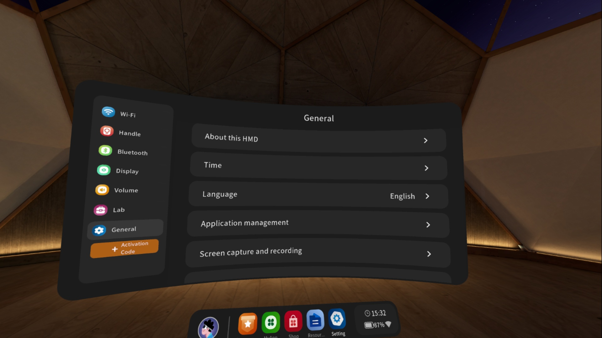
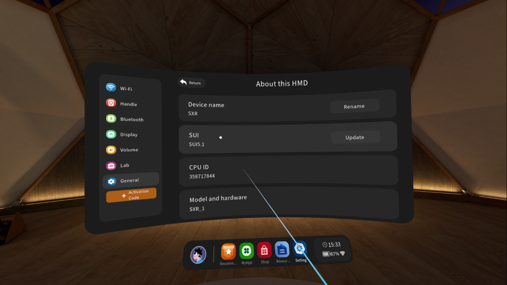
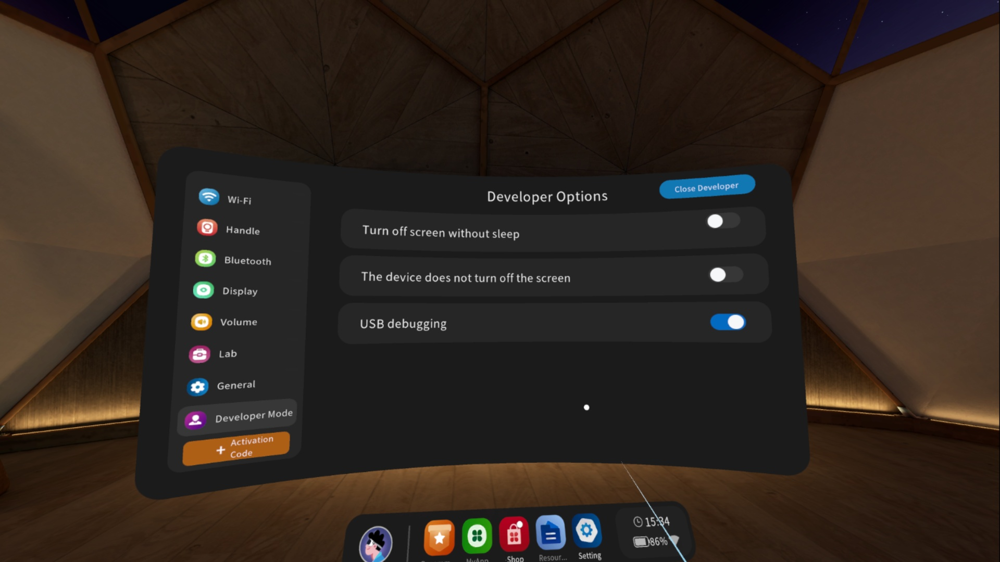

# Utilities and Tips

## Enabling Developer Mode

**Developer Mode** must be enabled to side load apps and to push and pull files from your computer to the LeonardoXR.

To enable Developer Mode perform the following steps.

1. Open **Settings** by clicking on the gear icon on the dock.

 

2. Select the **About this HMD** menu item from the left nav to show the About Panel.

3. In the About Panel, click on the **SUI** version label **7 times** without pausing. As you are clicking on the label a Toast Message will appear showing the countdown to enabling Developer Mode. When complete a Toast Message will indicate that the LeonardoXR is in developer mode.

 

> **Note**
> 
> Try not to pause between clicking on the **Software Version** label, doing so will restart the countdown.

4. A new **Developer Mode** button will appear at the bottom of the About Page. Click on the Developer Mode button to open the Developer Mode Panel.

5. In the Developer Mode Panel, make sure that **USB debugging** is on.

6. The first time you connect your LeonardoXR to your computer, a dialog box will appear on the LeonardoXR to confirm the connection. Accept the dialog box to connect to your computer. The LeonardoXR is now in Developer Mode and you can side load apps and copy files to and from your computer.

## ADB and USB Debugging

Android Debug Bridge or adb is a useful command-line tool used to communicate from a PC to an Android device. Android Debug Bridge is very useful for LeonardoXR app development. For more information about adb, please visit: [https://developer.android.com/tools/adb](https://developer.android.com/tools/adb)

[#](.) Useful ADB Commands
--------------------------

The following is a list of commonly used ADB commands.

### [#](.) Checking Connection to LeonardoXR

To check if your computer is connected to the LeonardoXR use the following command. The command should output your device's serial number.

`adb devices`

### [#](.) Sideloading Apps

To sideload apps onto the LeonardoXR use the following command.

* The **-r** flag means **replace** the app if it already exists.

* The **-g** flag means **grant** all priviledges to the app.

`adb install -r -g <app-name>.apk`

### [#](.) Screen Recording

To record the screen use the following command. To stop the video capture, type `Ctrl-C` at the command-line.

`adb shell screenrecord /sdcard/<file-name>.mp4`

Replace **file-name** with a name for your video. For example, if you wanted to name your file **video.mp4**, you would use the following command:

`adb shell screenrecord /sdcard/video.mp4`

After stopping the capture by typing `Ctrl-C`, you can copy the video file to your PC by using the following command:

`adb pull /sdcard/video.mp4`

[#](.) Screen Mirroring
--------------------------

Screen mirroring apps are used to mirror content displayed in a headset to a computer screen for others to see. These tools can be used to demo experiences, debug apps in a troubleshooting call, or perform basic configuration operations.

The two popular screen mirroring apps are **Vysor** and **Scrcpy** or “Screen Copy.” **SideQuest** can also be used for screen mirroring, but it uses **Scrcpy** to perform this function.

### [#](.) **Vysor**
----------------

Vysor is a screen mirroring app for Android devices that can be used with the LeonardoXR. It is a commercial application that has a polished UI and is available as freeware or a paid version. The freeware version has certain features disabled and advertisements are displayed. A full featured version is available with the purchase of a monthly, yearly, or lifetime license. There is also an enterprise license available. To learn more, visit the vysor website at [https://www.vysor.io/](https://www.vysor.io/  "https://www.vysor.io/").

### [#](.) **Scrcpy**
----------------- 

Scrcpy or “Screen Copy” is an open source screen mirroring app for Android devices. It can also be used with LeonardoXR devices. The easiest way to get started with Scrcpy is to just download the release version which contains a binary “.exe” file for Windows. 

[https://github.com/Genymobile/scrcpy/releases](https://github.com/Genymobile/scrcpy/releases  "https://github.com/Genymobile/scrcpy/releases")  

[#](.) Screen Recording
-----------------------

This last method, while not technically considered screen mirroring, may still be very useful for those who just want to capture the LeonardoXR displays to view or share later as an mp4 file.  

To record the screen use the following command. To stop the video capture, type `Ctrl-C` at the command-line.

`adb shell screenrecord /sdcard/<file-name>.mp4`

 Replace **file-name** with a name for your video. For example, if you wanted to name your file **video.mp4**, you would use the following command: 

`adb shell screenrecord /sdcard/video.mp4`  

After stopping the capture by typing `Ctrl-C`, you can copy the video file to your PC by using the following command:  

`adb pull /sdcard/video.mp4`  

[#](.) Useful Tips
----------------------  

Here are a few tips to get started with either Vysor or Scrcpy:  

*  **Enable Developer Mode**: Please note that the two options listed above require that the LeonardoXR device to be placed into [Developer Mode](#enabling-developer-mode).

*  **Wireless Connection**: Vysor, Scrcpy and ADB can connect wirelessly using WiFi. Please visit the Vysor, Scrcpy or Android Platform Tools website to learn more.

## PCVR Streaming Support

PCVR streaming runs the XR application on PC and streams the rendered frames to the headset in **real-time**, leveraging the PC’s superior GPU and CPU while keeping the headset untethered. This enables execution of **high-fidelity**, **resource-intensive content** that standalone hardware cannot handle. It facilitates rapid development, testing, and deployment of complex XR experiences — such as realistic training, detailed simulations, and high-end demos — while maintaining wireless mobility.

LeonardoXR supports PCVR streaming via a custom build of **ALVR** (desktop streamer and Android client) with full support for controllers and **hand tracking**.

List of ALVR available downloads on Youbiquo's developer site, in the **Tools** section:

* [ALVR Windows Streamer](https://developer.youbiquo.eu/docs/leonardo-xr/), version 1.0.0

* [ALVR Android Client](https://developer.youbiquo.eu/docs/leonardo-xr/), version 1.0.0

 

> **NOTE**
>
> Check [ALVR GitHub](https://github.com/alvr-org/ALVR) for more details about installation and usage.

Once ALVR and SteamVR have successfully connected, it will be possible to test Unity apps in-editor by pressing the **Play** button.

> **NOTE**
>
> LeonardoXR SDK in currently not supporting **Passthrough** feature through ALVR.

## WebXR Support

Inside the **Core Samples** folder there is a **WebXR** sample scene that contains all necessary to be deployed no-effort to WebXR compatible devices.

You will need to download the following software to get started:

* [De-Panther WebXR Export Utility](https://github.com/De-Panther/unity-webxr-export)

This utility will allow developers to build the application to target WebXR-enabled browsers on compatible devices (LeonardoXR comes with pre-installed customized **Wolvic** browser app for WebXR applications support).